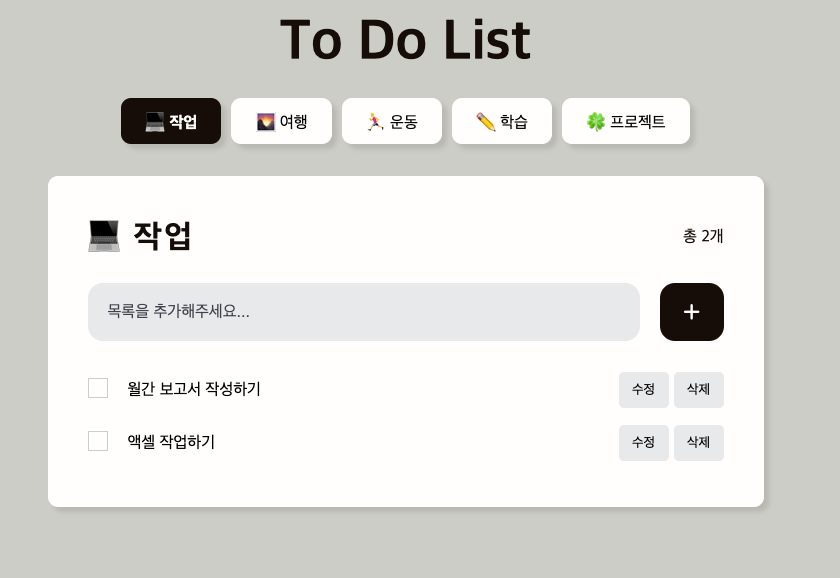

# 🍀 Todo List Application with Vanilla Javascript

## 한줄 소개

바닐라 자바스크립트를 사용하였으며 **클래스 기반**으로 코드를 구성하였습니다.

## 어플리케이션 구현 내용

- 기본적인 List `CRUD` 작업하였습니다.
- 작업 `Complete` 여부에 따라 동적인 UI를 구성하였습니다.
- 리스트에서 여러 `카테고리`를 추가하였습니다.
  - 카테고리별 리스트 갯수를 추가로 표현하였습니다.
- 사용성 개선 고려
  - 컨텐츠가 없을 시 `FallBack` 문구 추가하였습니다.
  - 리스트 추가 및 오류에 대해서 `Modal`을 통해서 사용자에게 응답메시지를 보냅니다.
- 기본 데이터 저장은 브라우저의 `Local Storage`를 이용하였습니다.

## 코드적 구현 내용

### 클래스 기반으로 구성

`UI 클래스`, `Store 클래스`, `Todo 클래스`, `Alert 클래스` 등 클래스를 정의하여 각각의 클래스의 인스턴스를 생성하여 코드를 구성하였습니다.

**단일책임원칙**을 따를 수 있도록 클래스간 **독립성**을 유지하였습니다.

### 파일들의 모듈화

- css
  - style.css
- images
- js
  - models
    - Todo.js
  - store
    - index.js
  - utils
    - dom.js
  - view
    - Alert.js
    - UI.js
  - main.js
- index.html

하나의 메인파일에서 모든 코드를 구현 및 관리하기 보다는 클래스와 관련된 함수들을 각 파일로 분리하여 `모듈화` 하였으며 가독성과 유지보수를 고려하였습니다.

## 배포 주소

## 시연 영상
